<h1 align="center">Kunyu(坤舆) - 更高效的企业资产收集</h1>

[](https://github.com/knownsec/Kunyu) [](https://github.com/knownsec/Kunyu/issues) [](https://github.com/knownsec/Kunyu/releases) [](https://github.com/wikiZ) [](https://github.com/wikiZ)

中文文档 | [English](../README.md)

# 0x00 介绍

## 工具介绍

Kunyu (坤舆)，名字取自 <坤舆万国全图> ，测绘实际上是一个地理信息相关的专业学科，针对海里的、陆地的、天上的地理信息进行盘点。同样应用于网络空间，发现未知、脆弱的资产也是如此，更像是一张网络空间地图，用来全面描述和展示网络空间资产、网络空间各要素及要素之间关系，以及网络空间和现实空间的映射关系。所以我认为“坤舆”还是比较贴合这个概念的。

Kunyu(坤舆)，旨在让企业资产收集更高效，使更多安全相关从业者了解、使用网络空间测绘技术。

## 应用场景

对于 kunyu 的使用，应用场景可以有很多，例如：

* 企业内遗忘的，孤立的资产进行识别并加入安全管理。 
* 企业外部暴露资产进行快速排查，统计。
* 红蓝对抗相关需求使用，对捕获IP进行批量检查。
* 批量收集脆弱资产(0day/1day) 影响内的设备、终端。
* 新型网络犯罪涉案站点信息进行快速收集，合并，进行更高效的研判、分析。
* 对互联网上受相关漏洞影响的脆弱资产，进行统计、复现。
* .......

# 0x01 安装

**需要Python3以上的支持**

```
git clone https://github.com/knownsec/Kunyu.git
cd Kunyu
pip3 install -r requirements.txt

Linux:
	python3 setup.py install
	kunyu console

Windows:
	cd kunyu
	python3 console.py

PYPI:
	pip3 install kunyu
	
P.S. Windows同样支持python3 setup.py install.
```

# 0x02 配置说明
在第一次运行程序时通过输入以下命令进行初始化操作，提供了其他登录方式，但是推荐使用API的方式，因为用户名/密码登录需要额外做一次请求，所以理论上API的方式会更加高效。
```
kunyu init --apikey <your zoomeye key> --seebug <your seebug key>
```
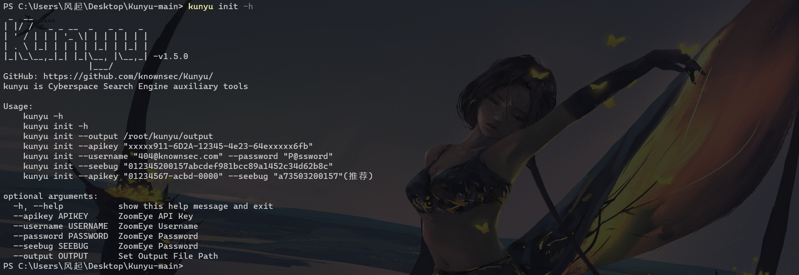

需要通过ZoomEye登录凭证，才使用该工具进行信息收集。

访问地址：https://www.zoomeye.org/

# 0x03 工具使用

## 命令详解

```
kunyu console
```


**ZoomEye**

```
Global commands:
        info                                      Print User info
        SearchHost <query>                        Basic Host search
        SearchWeb <query>                         Basic Web search
        SearchIcon <File>/<URL>                   Icon Image search
        SearchBatch <File>                        Batch search Host
        SearchCert <Domain>                       SSL certificate Search
        SearchDomain <Domain>                     Domain name associated/subdomain search
        EncodeHash <encryption> <query>     	  Encryption method interface 
        HostCrash <IP> <Domain>                   Host Header Scan hidden assets
        Seebug <Query>                            Search Seebug vulnerability information
        set <Option>                              Set arguments values
        Pocsuite3                                 Invoke the pocsuite component
        ExportPath                                Returns the path of the output file 
        clear                                     Clear the console screen
        show                                      Show can set options
        help                                      Print Help info
        exit                                      Exit KunYu & 
```

**OPTIONS**

```
ZoomEye:
	page <Number>    查询返回页数(默认查询一页，每页20条数据)
	dtype <0/1>      查询关联域名/子域名(设置0为查询关联域名，反之为子域名)
	btype <host/web> 设置批量查询的API接口(默认为HOST)
```

## 使用案例

*这里我们使用 ZoomEye 模块进行演示*

**用户信息**


**HOST 主机搜索**


**Web 主机搜索**


**批量 IP 搜索**

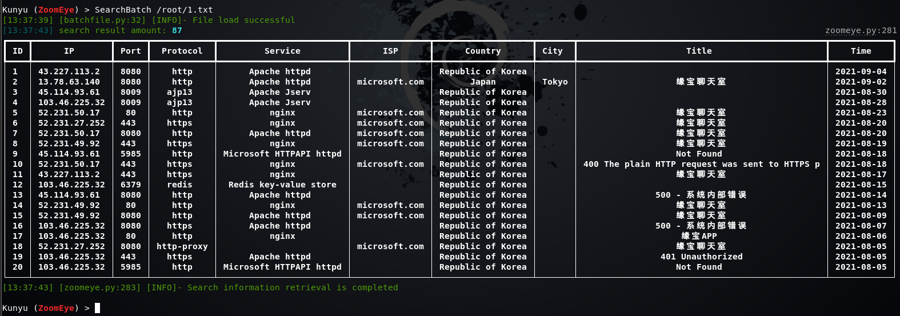

**Icon 搜索**

在搜集企业资产时，我们可以使用这样的方式进行检索相同 ico 图标资产，在关联相关企业资产时，通常会有不错的效果。但是需要注意的是如果某些站点也使用这个 ico 图标，可能会关联出无关资产(但是无聊用别人 ico 图标的人总归是少数吧)。支持url或本地文件的方式搜索。

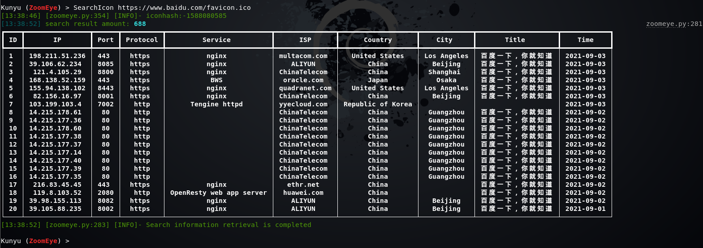

**SSL证书搜索**

通过 SSL 证书的序列号进行查询，这样关联出来的资产较为精准，能搜索出使用相同证书的服务。碰到https站点时，可以通过这样的方式。

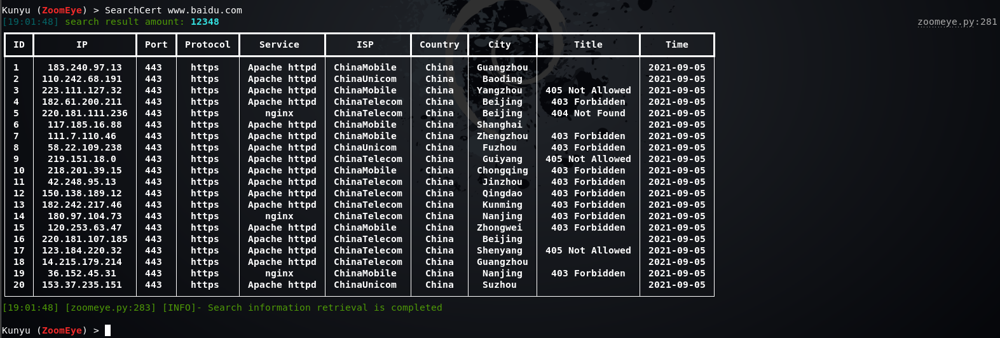

**特征搜索**

通过HTTP请求包特征或网站相关特征可以进行更加精准的串并相同框架资产

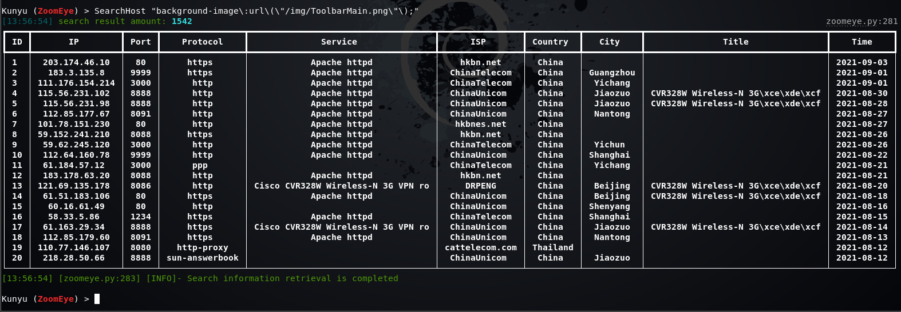

**多因素查询**

同样kunyu也支持多因素条件查询关联资产，可以通过ZoomEye逻辑运算语法实现。

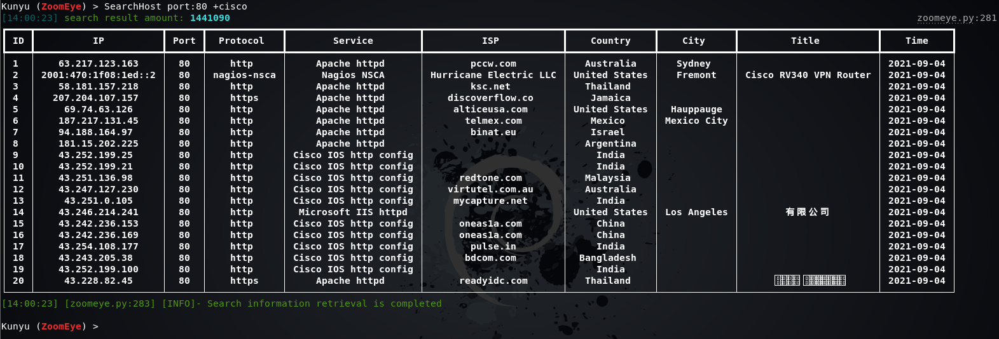

**关联域名/子域名搜索**

对关联域名以及子域名进行搜索，默认查询关联域名，可以通过设置 dtype 参数设置两种模式。

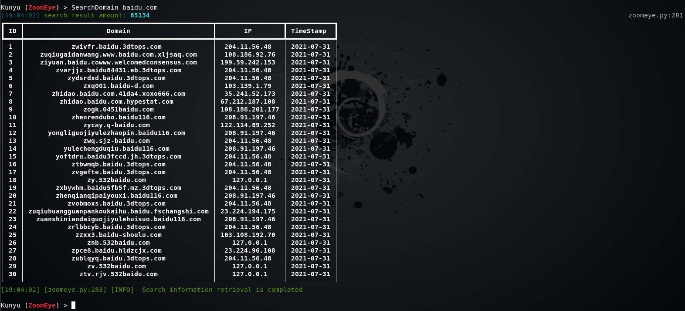

**编码哈希计算**

在一些场景下，可以通过该命令进行常用的HASH加密/编码，如：BASE64、MD5、mmh3、HEX编码，通过这种方式进行调试。

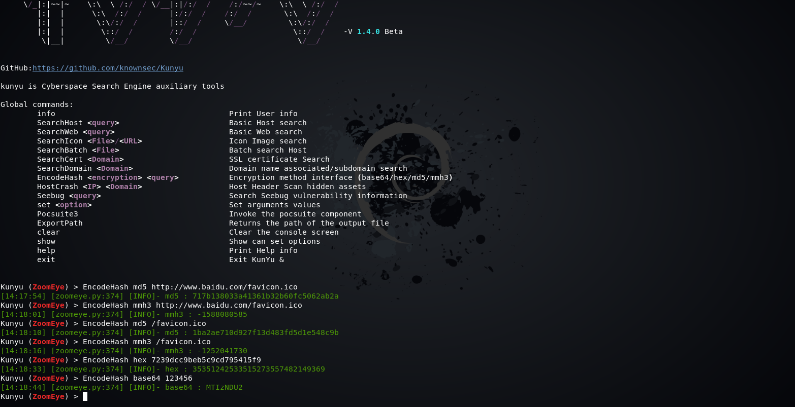

**Seebug漏洞查询**

通过输入想要查找的框架、设备等信息，查询历史相关漏洞，但是需要注意仅支持英文，这里后期会进行改进，升级。

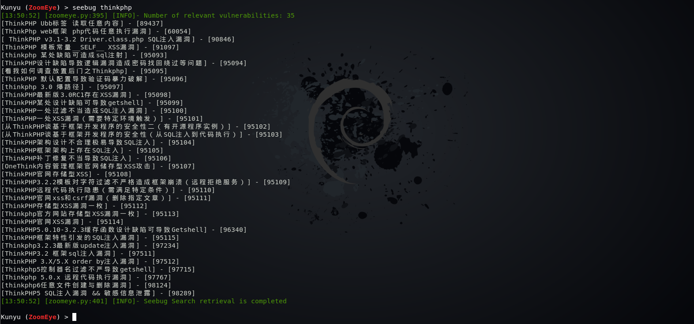

**设置参数**

当设置set page = 2时，返回结果为40条，大家可以通过修改page参数，设置查询的页数，需要注意1 page = 20/条 ，可以根据需求修改该值，获取更多返回结果。

通过show显示可配置的参数，以及参数当前的值。


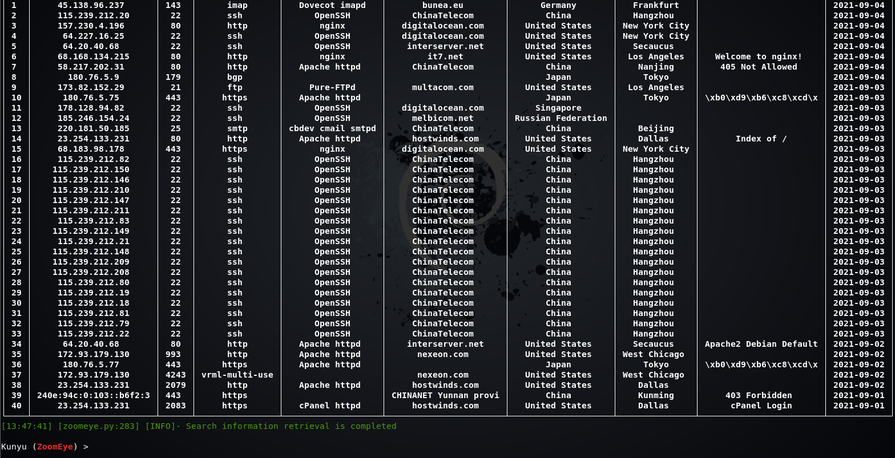

**Pocsuite3 联动**

在v1.3.1之后的版本中，您可以使用kunyu进行联动pocsuite3的console模式进行一体化的使用。

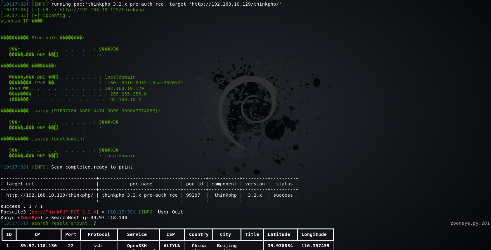

**HOSTS头碰撞**

通过HOSTS碰撞，可以有效的碰撞出内网中隐藏的资产，根据中间件httpf.conf中配置的ServerName域名和IP捆绑即可访问内网服务，后续通过设置本地hosts文件实现，因为本地hosts文件优先级高于DNS服务器解析。支持通过ZoomEye域名库反查或者读取TXT文件获取域名列表。


HOSTS交叉碰撞

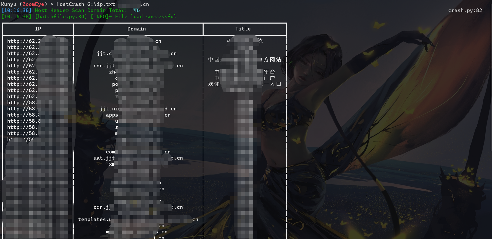

**数据结果**

搜索的所有结果都保存在用户根目录下，并根据当前时间戳创建目录。单次启动的所有查询结果都在一个目录下，保存为Excel格式，给予更加直观的体验。可以通过ExportPath命令返回输出路径。

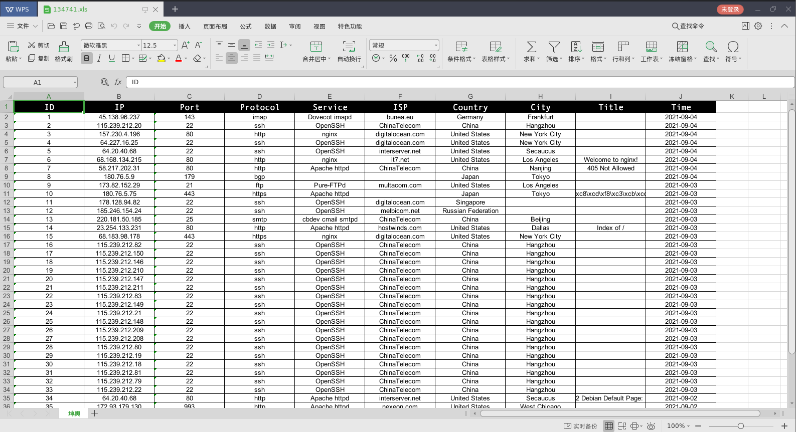


# 0x04 Loading

​    其实还有很多的思路，但是作为 Alpha 版本先这样，后期会不断进行完善的，希望 Kunyu (坤舆)能够让更多安全从业者所知，谢谢各位的支持。

​    工具框架有参考昆仑镜、Pocsuite3，都是非常棒的作品。	

​    感谢 KnownSec 404 Team 的全体小伙伴。

> “ 看得清 ” 是能力的体现，是 “ 器 ” ，而 “ 看得见 ” 就是思想的体现，那最后关联的是 “ 道 ”。
>
> ​																																							 	   --SuperHei

# 0x05 Issue

**1、多因素搜索**

ZoomEye搜索可以使用多因素搜索，dork：cisco +port:80(注意空格) 可以搜索符合cisco以及port:80条件的所有数据，如果没有中间的空格则为同一搜索条件，则为满足cisco并且端口为80的所有数据。Kunyu的dork无需引号。

**2、高精地理位置**

ZoomEye给予特权用户高精地理位置的数据，但是需要注意的是普通用户，则不具备该功能，望周知。

**3、用户名/密码登录**

如果您使用的是username/password作为初始化条件，那么所获得token时效为12小时，如果发现您的搜索不能返回数据，那么不妨info一下，如果会话超时则会返回初始化命令提示。绝大多数情况下我们建议您使用API KEY的方式，则不存在失效问题。这样的设计也是为了您账号密码的安全性，毕竟API KEY可以重置，token会失效，但是有了账号密码，则有可能登录您的ZoomEye账户。

**4、Cert证书搜索**

需要注意的是，按照常规逻辑，您需要将目标ssl证书的序列号进行十六进制编码后才能配合语句搜索，但是Kunyu则仅需要提供Domain地址则可以检索。原理是对目标站做了一次请求获取到了序列号并进行处理，但是如果您的主机无法访问需要搜索的目标则无法检索，这时您也可以按照常规方法配合语句搜索。

**5、Favicon图标搜索**

ico图标搜索既支持URL检索，又支持本地ico图标文件搜索，这样有了更好的延展性，以及兼容性。

**6、查询数据保存路径**

默认情况下您的查询数据在用户目录下的Kunyu文件夹中，您也可以在console模式中使用ExportPath命令查询路径。

**7、自动补全**

Kunyu的自动补全支持大小写，命令记录等，使用Tab进行补全，用法参见Metasploit即可。

**8、关于pip install kunyu使用时报错的问题**

在使用pip install kunyu时报以下错误：
`File "C:\Users\风起\AppData\Local\Programs\Python\Python37\Scripts\kunyu-script.py", line 1 SyntaxError: Non-UTF-8 code starting with '\xb7' in file C:\Users\风起\AppData\Local\Programs\Python\Python37\Scripts\kunyu-script.py on line 1, but no encoding declared; see http://python.org/dev/peps/pep-0263/ for details`

解决方案：
修改C:\Users\风起\AppData\Local\Programs\Python\Python37\Scripts\kunyu-script.py文件，在文件开头添加# encoding: utf-8
然后保存即可正常使用，该bug出现原因为用户目录路径存在中文名，通常出现在windows上。

**9、Pocsuite3模块POC存放目录**

对于使用pocsuite3模块时，如果想要新增POC模块，则可以在 **项目目录/pocsuite3/pocs/** 添加POC文件。

**10、Pocsuite3模块POC缺失问题**

使用Pocsuite命令联动时，如果是已经打包好的Kunyu版本，则poc已经被固定，这时修改poc目录是无法新增模块的，这时可以通过重新打包的方式，或者使用 **项目目录/kunyu/console.py** 运行kunyu可实时更新poc模块。

# 0x06 Contributions

[风起@knownsec 404](https://github.com/wikiZ)

[wh0am1i@knownsec 404](https://github.com/wh0am1i)  
[fenix@knownsec 404](https://github.com/13ph03nix)  
[0x7F@knownsec 404](https://github.com/0x7Fancy)


# 0x07 Community

如果有问题可以在项目下提交issue，或通过以下方式联系我们。

1、扫描一下二维码添加ZoomEye运营微信，并备注坤舆，会把大家拉到ZoomEye网空测绘交流群中


